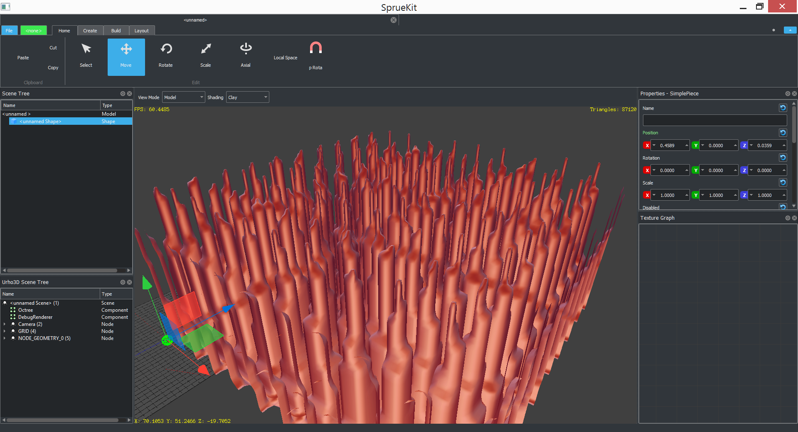

# UrhoEditor

Qt based Urho3D editor and general toolset.

Editor base library and front-end setup for editing Urho3D scenes.

# EditorLib

Contains the majority of UI code isolated for reuse.

SCE ATF style Dom structure is a work in progress and even when complete will not be intended for documents as varying/complex as an Urho3D/game scene.

# UrhoEditor

## Oddities

- DataSources are something that you would expect to be persistent, here they are ephemeral and constructed as needed.
    - Mirror a structure in UI creates unnecessary linkage of code
    - Instead many specialized controls placed in containers to select the appropriate widget (DocumentViewStackedWidget)
- Selectron is global, possibly misguided

## General Practices

- QString is preferred over std::string. Use std::string when needed.
    - This was not always true, migrate std::string to QString as encountered and refactoring scale is reasonable
- STL containers are preferred over Qt containers
- STL smart pointer types are preferred over raw pointers
    - Exceptions for "perfect" RAII types

## Widget Practices

- Use "accessible name" (setAccessibleName) to specify a human friendly name for every important widget.
    - "object name" is always assumed to be for "seek" purposes
    - This value is used for fetching display names whenever necessary (such as the "Location" name for search results)
    - It is also used as a translation key in many widgets
- Similarly use "accessibility description" (setAccessibleDescription) for setting the help/hint text.
    - "What's this?" should be the exact same content.
    - Do not use "What's This?", it is half baked.
- Widget "object name"s (setObjectName) should be unique and present in the InternalNames.h header in the root folder.

## Selected Object Management

Uses a class called the "Selectron" to manage active program selections.

The "Selectron" class manages the program's selections. It is "linked" against other controls that implement the "SelectronLinked" baseclass. Uses a single global selectron, but it viable to have multiple selectrons (such as per document, or set of functionality).

The Selectron emits signals when the selection is changed, the selection's data is changed, or a selection is rejected.

**Selection Changes**

A call to Selectron::SetSelected() will set a single object to the new selection then emit the SelectionChanged signal.

A call to Selectron::AddSelected() will add a new item to the list of selected items then emit the SelectionChanged signal.

A call to Selectron::RemoveSelected() will remove the given item from the list of selected items (if found) and then emit the SelectionChanged signal.

**Selection Data Changes**

A call to Selectron::NotifyDataChanged() will emit the DataChanged signal. The "hash" parameter can be used for identifying the specific property that was changed.

A common usage of this is for propogating changes to an object's name throughout the UI and for updating transform properties as a gizmo is moved.

## Special Interfaces

- ISearchable
    - Implement for any persistent types (typically widgets) that should be searchable via the search bar in the main menu.
- ISignificantControl
    - Attach as a baseclass to any widget that needs to be easy to find from any arbitrary block of code

## Locations of Operating System Specific code

- Everything in the "Platform" folder in EditorLib
    - VideoCard.h/.cpp, for detecting video card information
    - Thumbnails.h/.cpp, responsible for getting thumbnail previews from file paths

## Document / GuiBuilder

GUI code was written with the intent of keeping things easy to split off, however without so much engineering overhead as to be "click a button and fork" easy to split off. Some manual work is required in trimming code and the like, but the bulk of application specific code exists in the "GuiBuilder" folder and the specialized documents contained in "Documents" folder.

- Exceptions
    - Data folder contains datasources and other static data
    - Applications folder contains the initialization of different applications

### Ribbon is First Class

The ribbon is a first class citizen. All commands must be accessible from both the Ribbon and the legacy menu/toolbar UI, no pull requests will ever be approved that are not.

## Rendering Viewports

- All views derive from Views/ViewBase
- All gizmos derive from Views/Gizmo

The actual view is owned by a "DocumentBase" instance, of which a Document may have multiple different views which may be switched between for different reasons (such as viewing UV maps instead of a model). The view is responsible for managing it's internal Urho3D scene for rendering and registering any required ViewControllers.

Viewport interaction is controlled through "ViewController" derived control classes that are given the opportunity to assert themselves for processing during View logic execution. Views/Controllers/FlyController implements a flying camera control (WSAD/QE, mouse look/orbit) and Views/Controllers/GizmoController implements the manipulation of selected gizmos. Object selections are also handled through controllers (RaySelect and UrhoRaySelect).
